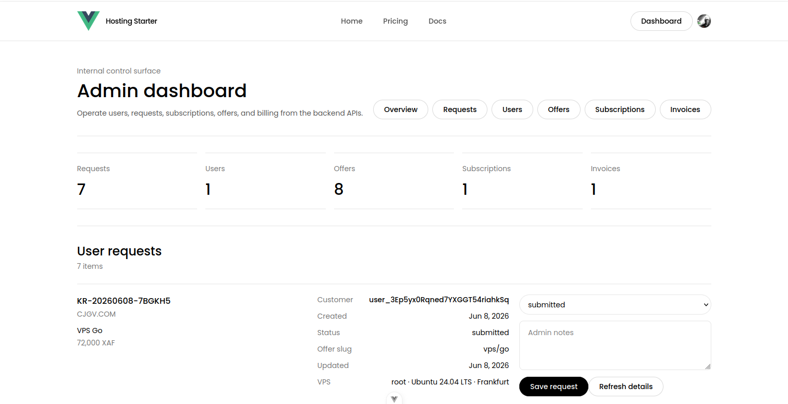
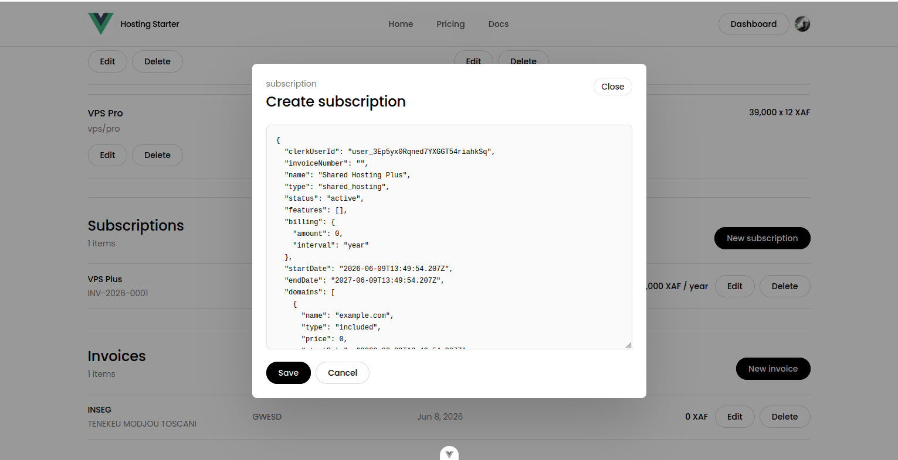
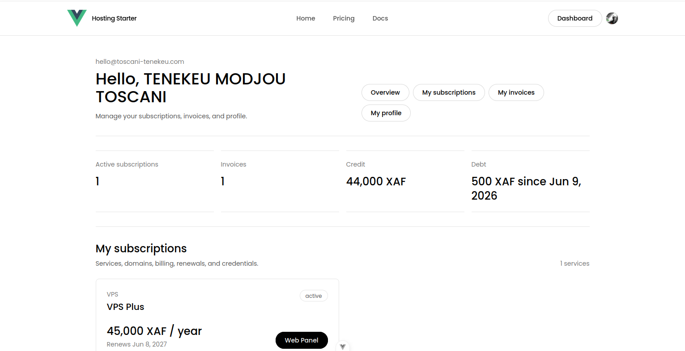
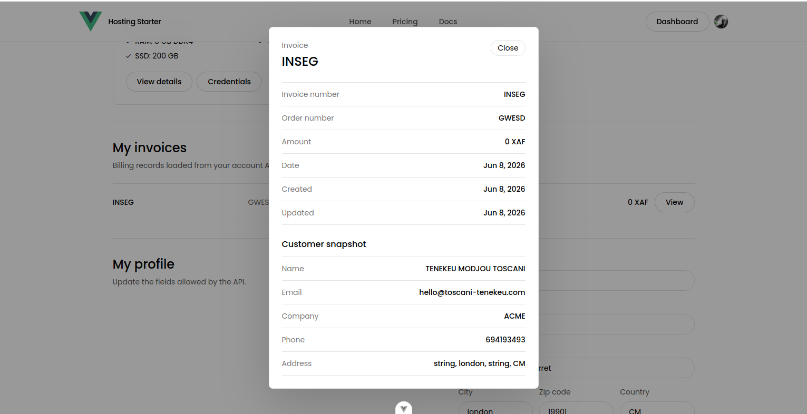

# Hosting Platform Backend

Backend API for a web hosting platform boilerplate to start a hosting company.

Compatible with:

- Shared Hosting
- VPS Services

Frontend part: [fullstack-hosting-plateform-vuejs-frontend-part](https://github.com/toscani-tenekeu/fullstack-hosting-plateform-vuejs-frontend-part)

## Screenshots

<table>
  <tr>
    <td width="50%">
      <strong>Admin dashboard overview</strong><br>
      
    </td>
    <td width="50%">
      <strong>Admin subscription editor</strong><br>
      
    </td>
  </tr>
  <tr>
    <td width="50%">
      <strong>Customer dashboard overview</strong><br>
      
    </td>
    <td width="50%">
      <strong>Customer invoice details</strong><br>
      
    </td>
  </tr>
</table>

## Requirements

- Node.js minimum: `20.19.0`
- Node.js recommended: `24.16.0`
- npm recommended: `11.13.0`
- MongoDB URI
- Clerk keys

## Installation

```bash
git clone https://github.com/toscani-tenekeu/fullstack-hosting-plateform-express-mongodb-backend-part.git
cd fullstack-hosting-plateform-express-mongodb-backend-part
npm install
cp .env.example .env
```

## Environment

Set these values in `.env`:

```env
PORT=3000
CLIENT_ORIGINS=http://localhost:5173,http://127.0.0.1:5173
MONGODB_URI=your_mongodb_uri
CLERK_PUBLISHABLE_KEY=your_clerk_publishable_key
CLERK_SECRET_KEY=your_clerk_secret_key
CLERK_WEBHOOK_SIGNING_SECRET=your_clerk_webhook_signing_secret
```

## Run

```bash
npm run dev
```

Open:

- `http://localhost:3000/health`
- `http://localhost:3000/api/docs`

## Scripts

```bash
npm run dev
npm run build
npm test
npm run seed:offers
```

## What It Handles

- Customer profiles
- Hosting offers
- Credit and debt
- Order requests
- Subscriptions
- Invoices
- Clerk authentication
- Clerk webhooks
- Admin operations

## Notes

- API docs: `/api/docs`
- OpenAPI JSON: `/api/openapi.json`
- Default currency: `XAF`
- Payments are manual by default
- Domain registration and DNS automation are not included
